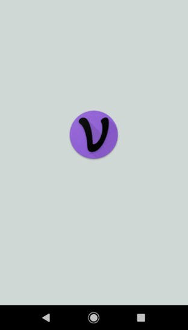
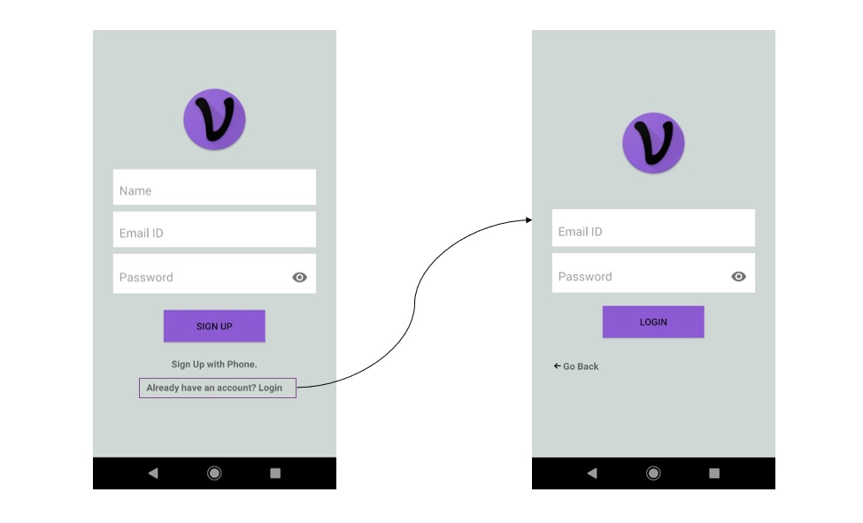
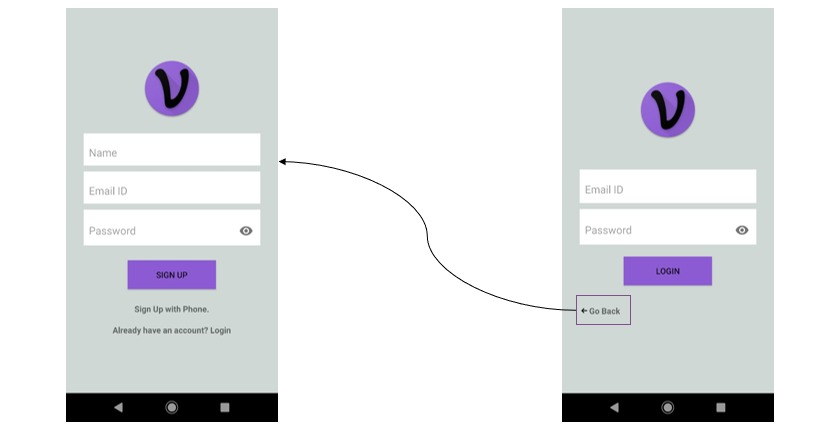
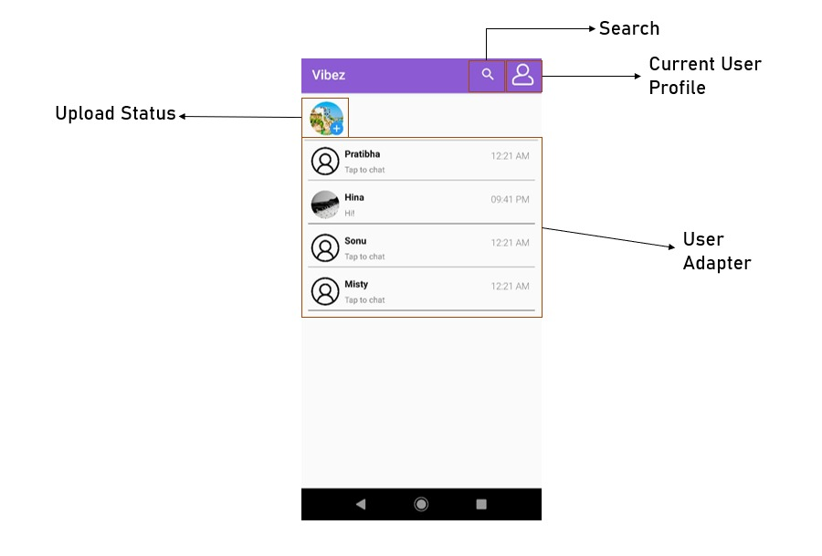
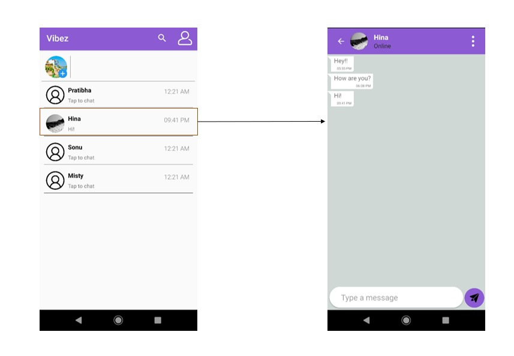
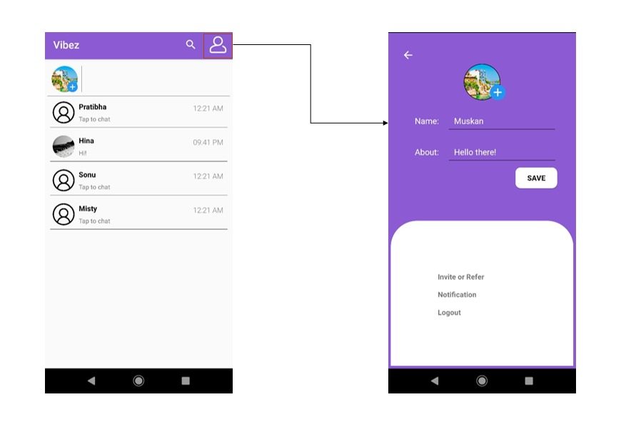
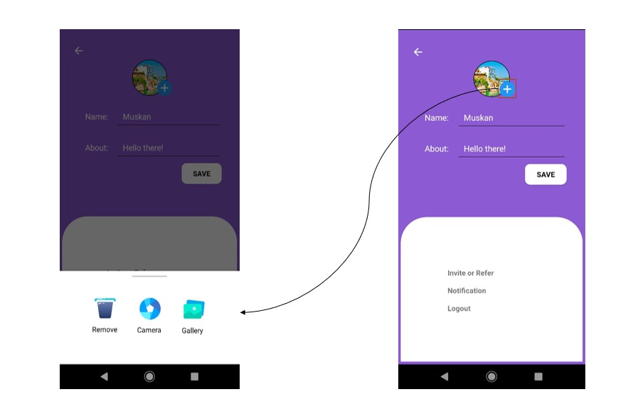
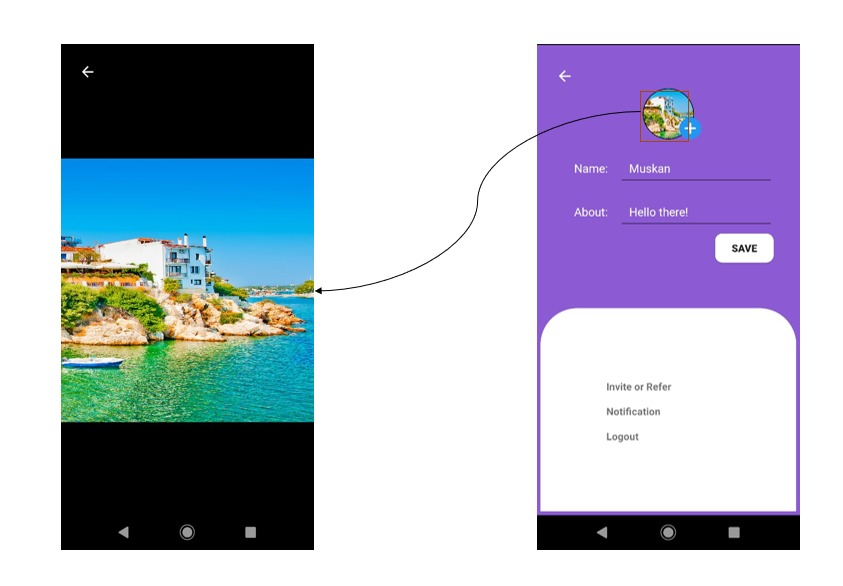
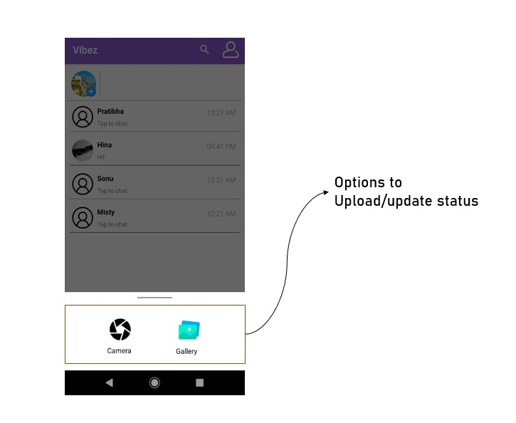
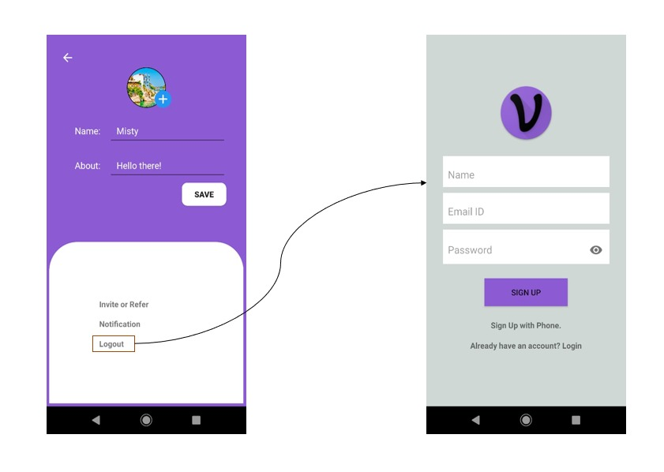

# Vibezz

A social media Android app built with **Java** and **Firebase** — real-time messaging, user profiles, and status sharing.

---

## About

Vibezz (earlier as Vibez) is an Android social media application that lets users sign up, connect with others, and chat in real time. Firebase powers the entire backend — authentication, live message syncing, and media storage. Built in Android Studio using Java, with a clean architecture split across Activities, Fragments, Adapters, and Models.

The app includes a working one-on-one messaging system with online/offline status, user profile editing with photo upload, a status feature (Camera/Gallery), and the groundwork for a posts and likes feed.

---

## Screenshots

### Splash Screen
<p align="center">
  
</p>

### Authentication Flow — Sign Up → Login
<p align="center">
  
</p>

### Authentication Flow — Login → Sign Up
<p align="center">
  
</p>

### Messaging — Chat List
<p align="center">
  
</p>

### Messaging Flow — Chat List → Chat Window
<p align="center">
  
</p>

### Profile Flow — Home → Profile Editor
<p align="center">
  
</p>

### Edit Profile Picture
<p align="center">
  
</p>

### Open Profile Picture
<p align="center">
  
</p>

### Status Upload
<p align="center">
  
</p>

### Logout Flow
<p align="center">
  
</p>

---

## Features

- **Authentication** — Email/password sign-up and login via Firebase Auth; phone sign-up also supported
- **Real-time Messaging** — One-on-one chat via Firebase Realtime Database with message timestamps and online/offline status indicators
- **User Profiles** — Edit display name, profile photo, and "About" bio; saved to Firestore
- **Status Upload** — Post a status image from Camera or Gallery (stored in Firebase Storage); displayed as a circular ring on the home screen
- **Smooth Transitions** — Custom enter/exit animations across all screens

---

## Tech Stack

| Layer | Technology |
|---|---|
| Language | Java |
| IDE | Android Studio |
| Min SDK | API 19 (Android 4.4+) |
| Target SDK | API 30 (Android 11) |
| Authentication | Firebase Auth |
| Realtime Database | Firebase Realtime Database |
| Cloud Database | Firebase Firestore |
| File Storage | Firebase Storage |
| Image Loading | Picasso |
| UI Components | RecyclerView, CircleImageView, CardView, ViewBinding |
| Status Ring | CircularStatusView (devlomi) |
| Build | Gradle + MultiDex |

---

## Project Structure

```
app/src/main/java/com/vibezz/
│
├── Activities/
│   ├── MainActivity.java       # Splash screen
│   ├── MainActivity2.java      # Home — chat list & status row
│   ├── SignUp.java             # Registration
│   ├── SignIn.java             # Login
│   ├── Chats.java              # One-on-one chat window
│   ├── Profile.java            # Edit your own profile
│   ├── UserProfile.java        # View another user's profile
│   └── Working.java            # In-progress utility activity
│
├── Adapter/
│   ├── UserAdapter.java        # RecyclerView adapter — user list
│   ├── MessageAdapter.java     # RecyclerView adapter — messages
│   └── FragmentsAdapter.java   # ViewPager adapter for tabs
│
├── Fragments/
│   ├── PostFragment.java       # Posts/feed tab (in progress)
│   └── LikeFragment.java      # Likes tab (in progress)
│
├── Models/
│   ├── Users.java              # User data model
│   └── Message.java            # Message data model
│
└── Extra/                      # Helper / utility classes
```

---

## Getting Started

### Prerequisites

- Android Studio (Arctic Fox or later)
- A Firebase project with the following enabled:
    - Authentication (Email/Password)
    - Realtime Database
    - Firestore
    - Storage
- Android device or emulator (API 19+)

### Setup

1. **Clone the repository**
   ```bash
   git clone https://github.com/mg-muskan/Vibezz.git
   cd Vibezz
   ```

2. **Open in Android Studio**
    - File → Open → select the cloned folder

3. **Connect Firebase**
    - Go to [Firebase Console](https://console.firebase.google.com/) and create a project
    - Register an Android app with package name `com.vibezz`
    - Download `google-services.json` and place it inside `app/`
    - Enable Authentication, Realtime Database, Firestore, and Storage

4. **Set Realtime Database rules** *(development only)*
   ```json
   {
     "rules": {
       ".read": "auth != null",
       ".write": "auth != null"
     }
   }
   ```

5. **Build and run**
    - Sync Gradle → Run (`Shift + F10`)

---

## Future Scope

- Full posts/feed with likes and comments
- Voice and video calling
- Push notifications via Firebase Cloud Messaging
- Connect via phone number in addition to email
- Material Design 3 UI refresh
- Performance optimisations and faster image loading

---

## Author

**Muskan Gupta** · [@mg-muskan](https://github.com/mg-muskan)

---

> This project is under active development. The repository will be updated as new features are added.
